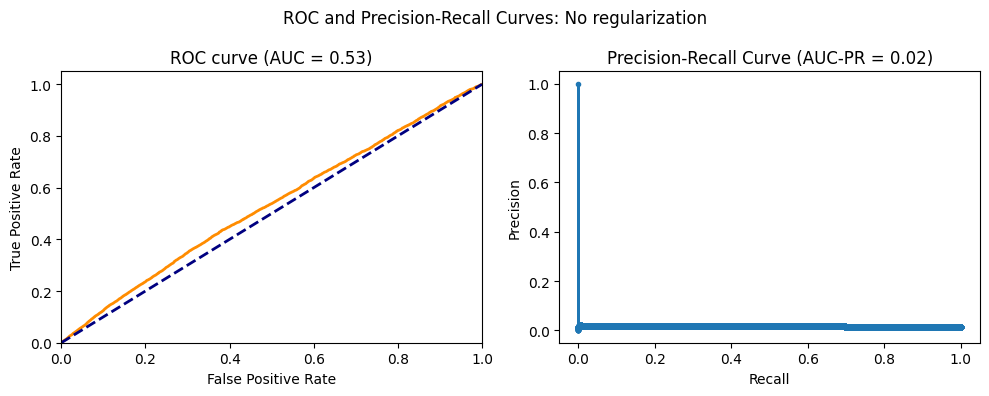
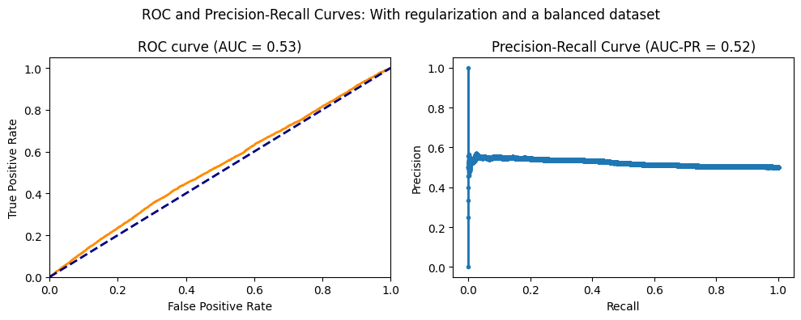
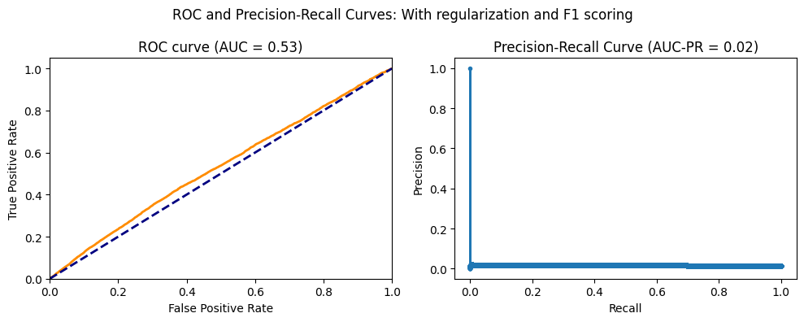

```python
import pandas as pd
import matplotlib.pyplot as plt
import random
from sklearn.linear_model import LogisticRegression
from sklearn.model_selection import GridSearchCV
from sklearn.utils import resample
from sklearn import metrics
import numpy as np

random.seed(1)

df = pd.read_csv('Datasets_Zrive/feature_frame.csv')
```

### Data Transformation


```python
df.info()
```

    <class 'pandas.core.frame.DataFrame'>
    RangeIndex: 2880549 entries, 0 to 2880548
    Data columns (total 27 columns):
     #   Column                            Dtype  
    ---  ------                            -----  
     0   variant_id                        int64  
     1   product_type                      object 
     2   order_id                          int64  
     3   user_id                           int64  
     4   created_at                        object 
     5   order_date                        object 
     6   user_order_seq                    int64  
     7   outcome                           float64
     8   ordered_before                    float64
     9   abandoned_before                  float64
     10  active_snoozed                    float64
     11  set_as_regular                    float64
     12  normalised_price                  float64
     13  discount_pct                      float64
     14  vendor                            object 
     15  global_popularity                 float64
     16  count_adults                      float64
     17  count_children                    float64
     18  count_babies                      float64
     19  count_pets                        float64
     20  people_ex_baby                    float64
     21  days_since_purchase_variant_id    float64
     22  avg_days_to_buy_variant_id        float64
     23  std_days_to_buy_variant_id        float64
     24  days_since_purchase_product_type  float64
     25  avg_days_to_buy_product_type      float64
     26  std_days_to_buy_product_type      float64
    dtypes: float64(19), int64(4), object(4)
    memory usage: 593.4+ MB


```python
print(len(df.vendor.value_counts()))
print(len(df.product_type.value_counts()))
```

    264
    62


```python
#FREQUENCY ENCODING

vendor_value_counts = df.vendor.value_counts()
product_type_counts = df.product_type.value_counts()

df['vendor'] = df['vendor'].apply(lambda x: vendor_value_counts[x]).astype('int32')
df['product_type'] = df['product_type'].apply(lambda x: product_type_counts[x]).astype('int32')

```


```python
#Changing Data Types

df = df.drop(['created_at'], axis=1)
df['outcome'] = df['outcome'].astype('int8')
df['order_date'] = pd.to_datetime(df['order_date'])
conversion_factor = 1e-9
df['order_date'] = df['order_date'].astype('int64').astype('float64') * conversion_factor


```


```python
#Reordering columns
new_order = df.columns.to_list()
new_order.remove('outcome')
new_order.remove('product_type')
new_order = ['outcome'] + new_order[:3] + ['product_type'] + new_order[3:]
df = df[new_order]
df.head()
```


<div>
<style scoped>
    .dataframe tbody tr th:only-of-type {
        vertical-align: middle;
    }

    .dataframe tbody tr th {
        vertical-align: top;
    }

    .dataframe thead th {
        text-align: right;
    }
</style>
<table border="1" class="dataframe">
  <thead>
    <tr style="text-align: right;">
      <th></th>
      <th>outcome</th>
      <th>variant_id</th>
      <th>order_id</th>
      <th>user_id</th>
      <th>product_type</th>
      <th>order_date</th>
      <th>user_order_seq</th>
      <th>ordered_before</th>
      <th>abandoned_before</th>
      <th>active_snoozed</th>
      <th>...</th>
      <th>count_children</th>
      <th>count_babies</th>
      <th>count_pets</th>
      <th>people_ex_baby</th>
      <th>days_since_purchase_variant_id</th>
      <th>avg_days_to_buy_variant_id</th>
      <th>std_days_to_buy_variant_id</th>
      <th>days_since_purchase_product_type</th>
      <th>avg_days_to_buy_product_type</th>
      <th>std_days_to_buy_product_type</th>
    </tr>
  </thead>
  <tbody>
    <tr>
      <th>0</th>
      <td>0</td>
      <td>33826472919172</td>
      <td>2807985930372</td>
      <td>3482464092292</td>
      <td>128098</td>
      <td>1.601856e+09</td>
      <td>3</td>
      <td>0.0</td>
      <td>0.0</td>
      <td>0.0</td>
      <td>...</td>
      <td>0.0</td>
      <td>0.0</td>
      <td>0.0</td>
      <td>2.0</td>
      <td>33.0</td>
      <td>42.0</td>
      <td>31.134053</td>
      <td>30.0</td>
      <td>30.0</td>
      <td>24.27618</td>
    </tr>
    <tr>
      <th>1</th>
      <td>0</td>
      <td>33826472919172</td>
      <td>2808027644036</td>
      <td>3466586718340</td>
      <td>128098</td>
      <td>1.601856e+09</td>
      <td>2</td>
      <td>0.0</td>
      <td>0.0</td>
      <td>0.0</td>
      <td>...</td>
      <td>0.0</td>
      <td>0.0</td>
      <td>0.0</td>
      <td>2.0</td>
      <td>33.0</td>
      <td>42.0</td>
      <td>31.134053</td>
      <td>30.0</td>
      <td>30.0</td>
      <td>24.27618</td>
    </tr>
    <tr>
      <th>2</th>
      <td>0</td>
      <td>33826472919172</td>
      <td>2808099078276</td>
      <td>3481384026244</td>
      <td>128098</td>
      <td>1.601856e+09</td>
      <td>4</td>
      <td>0.0</td>
      <td>0.0</td>
      <td>0.0</td>
      <td>...</td>
      <td>0.0</td>
      <td>0.0</td>
      <td>0.0</td>
      <td>2.0</td>
      <td>33.0</td>
      <td>42.0</td>
      <td>31.134053</td>
      <td>30.0</td>
      <td>30.0</td>
      <td>24.27618</td>
    </tr>
    <tr>
      <th>3</th>
      <td>0</td>
      <td>33826472919172</td>
      <td>2808393957508</td>
      <td>3291363377284</td>
      <td>128098</td>
      <td>1.601942e+09</td>
      <td>2</td>
      <td>0.0</td>
      <td>0.0</td>
      <td>0.0</td>
      <td>...</td>
      <td>0.0</td>
      <td>0.0</td>
      <td>0.0</td>
      <td>2.0</td>
      <td>33.0</td>
      <td>42.0</td>
      <td>31.134053</td>
      <td>30.0</td>
      <td>30.0</td>
      <td>24.27618</td>
    </tr>
    <tr>
      <th>4</th>
      <td>0</td>
      <td>33826472919172</td>
      <td>2808429314180</td>
      <td>3537167515780</td>
      <td>128098</td>
      <td>1.601942e+09</td>
      <td>3</td>
      <td>0.0</td>
      <td>0.0</td>
      <td>0.0</td>
      <td>...</td>
      <td>0.0</td>
      <td>0.0</td>
      <td>0.0</td>
      <td>2.0</td>
      <td>33.0</td>
      <td>42.0</td>
      <td>31.134053</td>
      <td>30.0</td>
      <td>30.0</td>
      <td>24.27618</td>
    </tr>
  </tbody>
</table>
<p>5 rows × 26 columns</p>
</div>


```python
#Filtering for transactions with more than 5 items sold
df_orders = df.groupby(by='order_id')['outcome'].sum()
print(len(df_orders))
transac_5_items = df_orders[df_orders>5].index.to_list()
```

    3446


```python
#Splitting for test/train/validation, keeping the transactions in the same dataset to avoid data leakeage

random.shuffle(transac_5_items)

train_data_orders =  transac_5_items[:int(len(transac_5_items)*0.7)]
val_data_orders = transac_5_items[int(len(transac_5_items)*0.7):int(len(transac_5_items)*0.9)]
test_data_orders = transac_5_items[int(len(transac_5_items)*0.9):]
```

### Main Models


```python
train_data_x = df[df['order_id'].isin(train_data_orders)].iloc[:,4:]
train_data_y = df[df['order_id'].isin(train_data_orders)].iloc[:,0]
val_data_x = df[df['order_id'].isin(val_data_orders)].iloc[:,4:]
val_data_y = df[df['order_id'].isin(val_data_orders)].iloc[:,0]
test_data_x = df[df['order_id'].isin(test_data_orders)].iloc[:,4:]
test_data_y = df[df['order_id'].isin(test_data_orders)].iloc[:,0]
```


```python
def draw_roc_prc(real_y, y_prob, title):
    '''
    Plots a ROC and a Precision and Recall curve.
    '''
    fig, ax = plt.subplots(1, 2, figsize=(10, 4))
    fpr, tpr, thresholds = metrics.roc_curve(real_y, y_prob)
    roc_auc = metrics.auc(fpr, tpr)
    
    fig.suptitle(f'ROC and Precision-Recall Curves: {title}')

    ax[0].set_title(f'ROC curve (AUC = {roc_auc:.2f})')
    ax[0].plot(fpr, tpr, color='darkorange', lw=2)
    ax[0].plot([0, 1], [0, 1], color='navy', lw=2, linestyle='--')
    ax[0].set_xlim([0.0, 1.0])
    ax[0].set_ylim([0.0, 1.05])
    ax[0].set_xlabel('False Positive Rate')
    ax[0].set_ylabel('True Positive Rate')

    precision, recall, thresholds = metrics.precision_recall_curve(real_y, y_prob)

    average_precision = metrics.average_precision_score(real_y, y_prob)

    ax[1].plot(recall, precision, marker='.')
    ax[1].set_xlabel('Recall')
    ax[1].set_ylabel('Precision')
    ax[1].set_title('Precision-Recall Curve (AUC-PR = {:.2f})'.format(average_precision))
    plt.tight_layout()
    plt.show()


```


```python
#Base model with no penalties
log_model_base = LogisticRegression(penalty= None, n_jobs=-1, class_weight='balanced').fit(train_data_x,train_data_y)

y_train_pred_base = log_model_base.predict(train_data_x)
y_train_prob_base = log_model_base.predict_proba(train_data_x)[:,1]

draw_roc_prc(train_data_y, y_train_prob_base,"No regularization")
print(metrics.confusion_matrix(train_data_y,y_train_pred_base))

```


    

    


    [[1394040       0]
     [  21434       0]]


```python
def best_threshold(y_true:pd.core.series.Series, y_prob:np.ndarray)->int:
    '''
    Function to obtain the threshold that minimizes false positive to be the closest possible to 1%.
    '''
    mean = y_prob.mean()
    std = y_prob.std()
    thresholds = np.arange(mean - 3*std, mean + 3*std, std/5)

    best_threshold = None

    for threshold in thresholds:

        y_pred = (y_prob >= threshold).astype(int)
        
        false_positives = metrics.confusion_matrix(y_true, y_pred)[0][1]

        if false_positives > y_true.sum()/100:
            best_threshold = threshold

    print(f"Best Threshold: {best_threshold}")

    return best_threshold
```


```python
threshold_base = best_threshold(train_data_y, y_train_prob_base)
```

    Best Threshold: 0.49994339123985077


```python
#Model with l2 Regularization

param_grid = {
    'C': [10 ** i for i in range(-4,3)],
    'penalty': ['l2']}

log_model_reg = LogisticRegression(n_jobs=-1, class_weight='balanced')

grid_search_l2 = GridSearchCV(log_model_reg, param_grid, cv=5, scoring='accuracy',n_jobs=-1).fit(train_data_x,train_data_y)

print(grid_search_l2.best_params_)

y_train_pred_l2 = grid_search_l2.predict(train_data_x)
y_train_prob_l2 = grid_search_l2.predict_proba(train_data_x)[:,1]

draw_roc_prc(train_data_y, y_train_prob_l2,"With regularization")
print(metrics.confusion_matrix(train_data_y,y_train_pred_l2))

```

    {'C': 0.0001, 'penalty': 'l2'}


    

    


    [[1394040       0]
     [  21434       0]]


```python
threshold_l2 = best_threshold(train_data_y, y_train_prob_l2)
```

    Best Threshold: 0.49994339123985077


```python
#New balanced dataset with 50% 0 incomes and 1 outcomes
train_data = df[df['order_id'].isin(train_data_orders)]
majority_class = train_data[train_data['outcome'] == 0]
minority_class = train_data[train_data['outcome'] == 1]

majority_class_undersampled = resample(majority_class, replace=False, n_samples=len(minority_class), random_state=42)

balanced_df = pd.concat([majority_class_undersampled, minority_class])

balanced_df
```


<div>
<style scoped>
    .dataframe tbody tr th:only-of-type {
        vertical-align: middle;
    }

    .dataframe tbody tr th {
        vertical-align: top;
    }

    .dataframe thead th {
        text-align: right;
    }
</style>
<table border="1" class="dataframe">
  <thead>
    <tr style="text-align: right;">
      <th></th>
      <th>outcome</th>
      <th>variant_id</th>
      <th>order_id</th>
      <th>user_id</th>
      <th>product_type</th>
      <th>order_date</th>
      <th>user_order_seq</th>
      <th>ordered_before</th>
      <th>abandoned_before</th>
      <th>active_snoozed</th>
      <th>...</th>
      <th>count_children</th>
      <th>count_babies</th>
      <th>count_pets</th>
      <th>people_ex_baby</th>
      <th>days_since_purchase_variant_id</th>
      <th>avg_days_to_buy_variant_id</th>
      <th>std_days_to_buy_variant_id</th>
      <th>days_since_purchase_product_type</th>
      <th>avg_days_to_buy_product_type</th>
      <th>std_days_to_buy_product_type</th>
    </tr>
  </thead>
  <tbody>
    <tr>
      <th>591213</th>
      <td>0</td>
      <td>33667282075780</td>
      <td>2861168459908</td>
      <td>3815052968068</td>
      <td>31593</td>
      <td>1.606867e+09</td>
      <td>2</td>
      <td>0.0</td>
      <td>0.0</td>
      <td>0.0</td>
      <td>...</td>
      <td>0.0</td>
      <td>0.0</td>
      <td>0.0</td>
      <td>2.0</td>
      <td>33.0</td>
      <td>36.0</td>
      <td>28.786199</td>
      <td>27.0</td>
      <td>30.0</td>
      <td>24.688701</td>
    </tr>
    <tr>
      <th>1100617</th>
      <td>0</td>
      <td>34086450987140</td>
      <td>2887443120260</td>
      <td>3874925314180</td>
      <td>51266</td>
      <td>1.609632e+09</td>
      <td>2</td>
      <td>0.0</td>
      <td>0.0</td>
      <td>0.0</td>
      <td>...</td>
      <td>0.0</td>
      <td>0.0</td>
      <td>0.0</td>
      <td>2.0</td>
      <td>33.0</td>
      <td>54.0</td>
      <td>34.910030</td>
      <td>30.0</td>
      <td>36.0</td>
      <td>28.268085</td>
    </tr>
    <tr>
      <th>2007369</th>
      <td>0</td>
      <td>33667185016964</td>
      <td>2885305139332</td>
      <td>3745761755268</td>
      <td>54442</td>
      <td>1.609286e+09</td>
      <td>3</td>
      <td>0.0</td>
      <td>0.0</td>
      <td>0.0</td>
      <td>...</td>
      <td>0.0</td>
      <td>0.0</td>
      <td>0.0</td>
      <td>2.0</td>
      <td>33.0</td>
      <td>37.0</td>
      <td>20.293677</td>
      <td>30.0</td>
      <td>36.0</td>
      <td>29.372186</td>
    </tr>
    <tr>
      <th>2600832</th>
      <td>0</td>
      <td>34284953796740</td>
      <td>2920192966788</td>
      <td>3898440056964</td>
      <td>45381</td>
      <td>1.613088e+09</td>
      <td>2</td>
      <td>0.0</td>
      <td>0.0</td>
      <td>0.0</td>
      <td>...</td>
      <td>0.0</td>
      <td>0.0</td>
      <td>0.0</td>
      <td>2.0</td>
      <td>33.0</td>
      <td>37.5</td>
      <td>30.297336</td>
      <td>30.0</td>
      <td>24.0</td>
      <td>26.048133</td>
    </tr>
    <tr>
      <th>1096726</th>
      <td>0</td>
      <td>34137389105284</td>
      <td>2868033257604</td>
      <td>3766058123396</td>
      <td>114978</td>
      <td>1.607472e+09</td>
      <td>3</td>
      <td>0.0</td>
      <td>0.0</td>
      <td>0.0</td>
      <td>...</td>
      <td>0.0</td>
      <td>0.0</td>
      <td>0.0</td>
      <td>2.0</td>
      <td>33.0</td>
      <td>45.0</td>
      <td>29.815304</td>
      <td>30.0</td>
      <td>32.0</td>
      <td>28.189363</td>
    </tr>
    <tr>
      <th>...</th>
      <td>...</td>
      <td>...</td>
      <td>...</td>
      <td>...</td>
      <td>...</td>
      <td>...</td>
      <td>...</td>
      <td>...</td>
      <td>...</td>
      <td>...</td>
      <td>...</td>
      <td>...</td>
      <td>...</td>
      <td>...</td>
      <td>...</td>
      <td>...</td>
      <td>...</td>
      <td>...</td>
      <td>...</td>
      <td>...</td>
      <td>...</td>
    </tr>
    <tr>
      <th>2860233</th>
      <td>1</td>
      <td>34304342851716</td>
      <td>2827489443972</td>
      <td>3765099954308</td>
      <td>10120</td>
      <td>1.603930e+09</td>
      <td>2</td>
      <td>0.0</td>
      <td>0.0</td>
      <td>0.0</td>
      <td>...</td>
      <td>0.0</td>
      <td>0.0</td>
      <td>0.0</td>
      <td>2.0</td>
      <td>33.0</td>
      <td>47.0</td>
      <td>31.017468</td>
      <td>30.0</td>
      <td>39.0</td>
      <td>35.641908</td>
    </tr>
    <tr>
      <th>2860234</th>
      <td>1</td>
      <td>34304342851716</td>
      <td>2827551244420</td>
      <td>3513667223684</td>
      <td>10120</td>
      <td>1.603930e+09</td>
      <td>4</td>
      <td>0.0</td>
      <td>0.0</td>
      <td>0.0</td>
      <td>...</td>
      <td>0.0</td>
      <td>0.0</td>
      <td>0.0</td>
      <td>2.0</td>
      <td>33.0</td>
      <td>47.0</td>
      <td>31.017468</td>
      <td>30.0</td>
      <td>39.0</td>
      <td>35.641908</td>
    </tr>
    <tr>
      <th>2860261</th>
      <td>1</td>
      <td>34304342851716</td>
      <td>2829221494916</td>
      <td>3784403714180</td>
      <td>10120</td>
      <td>1.604102e+09</td>
      <td>2</td>
      <td>0.0</td>
      <td>0.0</td>
      <td>0.0</td>
      <td>...</td>
      <td>0.0</td>
      <td>0.0</td>
      <td>0.0</td>
      <td>2.0</td>
      <td>33.0</td>
      <td>47.0</td>
      <td>31.017468</td>
      <td>30.0</td>
      <td>39.0</td>
      <td>35.641908</td>
    </tr>
    <tr>
      <th>2863549</th>
      <td>1</td>
      <td>33826433859716</td>
      <td>2823601127556</td>
      <td>3469897564292</td>
      <td>20585</td>
      <td>1.603411e+09</td>
      <td>2</td>
      <td>0.0</td>
      <td>0.0</td>
      <td>0.0</td>
      <td>...</td>
      <td>0.0</td>
      <td>0.0</td>
      <td>0.0</td>
      <td>2.0</td>
      <td>33.0</td>
      <td>82.0</td>
      <td>44.243644</td>
      <td>30.0</td>
      <td>38.5</td>
      <td>31.832738</td>
    </tr>
    <tr>
      <th>2863654</th>
      <td>1</td>
      <td>33826433859716</td>
      <td>2829871546500</td>
      <td>3771764834436</td>
      <td>20585</td>
      <td>1.604189e+09</td>
      <td>3</td>
      <td>0.0</td>
      <td>0.0</td>
      <td>0.0</td>
      <td>...</td>
      <td>0.0</td>
      <td>0.0</td>
      <td>0.0</td>
      <td>2.0</td>
      <td>33.0</td>
      <td>82.0</td>
      <td>44.243644</td>
      <td>30.0</td>
      <td>38.5</td>
      <td>31.832738</td>
    </tr>
  </tbody>
</table>
<p>42868 rows × 26 columns</p>
</div>


```python
balanced_train_data_x = balanced_df.iloc[:,4:]
balanced_train_data_y = balanced_df.iloc[:,0]

#Logistic regression with balanced training data

param_grid = {
    'C': [10 ** i for i in range(-4,2)],
    'penalty': ['l2']
}

log_model_balanced = LogisticRegression(solver='lbfgs',n_jobs=-1, class_weight='balanced')

grid_search_balanced = GridSearchCV(log_model_balanced, param_grid, cv=5, scoring='accuracy').fit(balanced_train_data_x,balanced_train_data_y)

print(grid_search_balanced.best_params_)

y_train_pred_balanced = grid_search_balanced.predict(balanced_train_data_x)
y_train_prob_balanced = grid_search_balanced.predict_proba(balanced_train_data_x)[:,1]

draw_roc_prc(balanced_train_data_y, y_train_prob_balanced,"With regularization and a balanced dataset")
print(metrics.confusion_matrix(balanced_train_data_y,y_train_pred_balanced))


```

    {'C': 0.0001, 'penalty': 'l2'}


    

    


    [[21434     0]
     [21434     0]]


```python
threshold_balanced = best_threshold(balanced_train_data_y, y_train_prob_balanced)
```

    Best Threshold: 0.4999481480929332


```python
#Linear regression model with Reguarization and F1 scoring

param_grid = {
    'penalty': ['l2'],
    'C': [0.001, 0.01, 0.1, 1, 10, 100],
    'class_weight': ['balanced']
}

log_model = LogisticRegression()

scorer = metrics.make_scorer(metrics.f1_score)

grid_search_f1 = GridSearchCV(log_model, param_grid, cv=5, scoring=scorer, n_jobs=-1).fit(train_data_x, train_data_y)

print(grid_search_f1.best_estimator_)

y_train_pred_f1 = grid_search_f1.predict(train_data_x)
y_train_prob_f1 = grid_search_f1.predict_proba(train_data_x)[:,1]

draw_roc_prc(train_data_y, y_train_prob_f1,"With regularization and F1 scoring")
print(metrics.confusion_matrix(train_data_y,y_train_pred_f1))


```

    LogisticRegression(C=0.001, class_weight='balanced')


    

    


    [[1394040       0]
     [  21434       0]]


```python
threshold_f1 = best_threshold(train_data_y, y_train_prob_f1)
```

    Best Threshold: 0.49994339123985077


### Validation Comparison


```python
val_data_y.value_counts()
```


    outcome
    0    399179
    1      5949
    Name: count, dtype: int64


```python
grid_search_base_val_pred = (log_model_base.predict_proba(val_data_x)[:,1] >= threshold_base).astype(int)
grid_search_l2_val_pred = (grid_search_l2.predict_proba(val_data_x)[:,1] >= threshold_l2).astype(int)
grid_search_f1_val_pred = (grid_search_f1.predict_proba(val_data_x)[:,1] >= threshold_f1).astype(int)
grid_search_balanced_val_pred = (grid_search_balanced.predict_proba(val_data_x)[:,1] >= threshold_balanced).astype(int)
```


```python

print(metrics.confusion_matrix(val_data_y,grid_search_base_val_pred))
print(metrics.confusion_matrix(val_data_y,grid_search_l2_val_pred))
print(metrics.confusion_matrix(val_data_y,grid_search_f1_val_pred))
print(metrics.confusion_matrix(val_data_y,grid_search_balanced_val_pred))
```

    [[397965   1214]
     [  5931     18]]
    [[397965   1214]
     [  5931     18]]
    [[397965   1214]
     [  5931     18]]
    [[396069   3110]
     [  5887     62]]


```python

print(metrics.f1_score(val_data_y, grid_search_base_val_pred))
print(metrics.f1_score(val_data_y,grid_search_l2_val_pred))
print(metrics.f1_score(val_data_y,grid_search_f1_val_pred))
print(metrics.f1_score(val_data_y,grid_search_balanced_val_pred))
```

    0.005013229355243003
    0.005013229355243003
    0.005013229355243003
    0.013595000548185505


```python
print(metrics.accuracy_score(grid_search_base_val_pred,val_data_y))
print(metrics.accuracy_score(grid_search_l2_val_pred,val_data_y))
print(metrics.accuracy_score(val_data_y,grid_search_f1_val_pred))
print(metrics.accuracy_score(grid_search_balanced_val_pred,val_data_y))
```

    0.9823635986651132
    0.9823635986651132
    0.9823635986651132
    0.9777922039454198


### Test Comparison

All three logistic regression models performed the same, therefore I decided to choose one of them.


```python
test_data_y.value_counts()
```


    outcome
    0    199352
    1      3096
    Name: count, dtype: int64


```python
grid_search_f1_test_pred = (grid_search_f1.predict_proba(test_data_x)[:,1] >= threshold_f1).astype(int)
print(metrics.accuracy_score(test_data_y, grid_search_f1_test_pred))
```

    0.9787945546510709


```python

print(metrics.confusion_matrix(test_data_y, grid_search_f1_test_pred))
```

    [[198131   1221]
     [  3072     24]]

